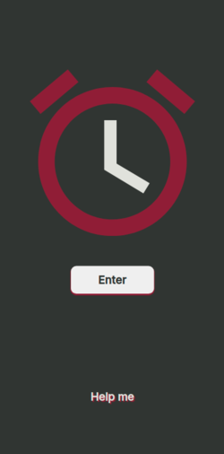
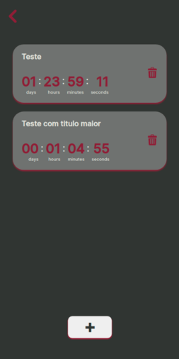
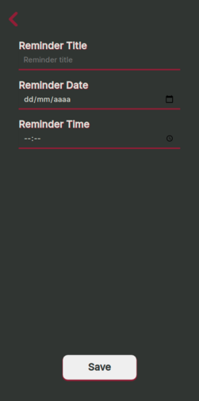

# How Many Left

---

### Tulio Vicente Ferreira da Silva

Essa aplicação tem como função principal o armazenamento e exibição de lembretes, com data e hora, mostrando quanto tempo resta [em Dias, Horas, Minutos e Segundos] para um evento listado ocorrer.

**OBS:** _a ideia inicial para esse trabalho seria uma aplicação para listagem de restaurantes, porém percebi que não era uma ideia tão boa assim._

## Telas

Todas as telas dessa aplicação são carregadas dinamicamente e injetadas na tag `main` do `index.html`, sendo assim possuem UM comportamento semelhante à uma `SPA`.

---

### 1. Home

Essa é a tela que será exibida ao usuário entrar no aplicativo.

Ao clicar em `Help` um _alert_ é exibido explicando um pouco mais sobre a aplicação.
Ao clicar em `Enter` o usuário é direcionado para a tela que lista os lembretes.
Por trás dos panos é nessa tela que os demais `templates` são lidos e os reminder carregados do `localStorage`.

### 2. List

Essa tela tem como função listar os lembres que o usuário cadastrou.

Cada evento tem uma data para acontecer, e a principal _feature_ desse aplicativo é contar exatamente quanto tempo falta para o evento acontecer.

Ao clicar no botão `+` o usuário terá a opção de cadastrar um novo lembrete. Caso queira deletar um lembrete basta clicar no ícone de lixeira ao lado do mesmo. Ao clicar no ícone no canto superior esquerdo, o usuário irá retornar à _home screen._

### 3. Create

Nessa tela é possível criar novos lembretes. O único campo obrigatório é o de **data**, criando assim um evento chamado de **Untitled Event**, que começará no horário **00:00** da data informada.

É importante deixar claro que, ao tentar criar um lembrete com data inferior à atual, o aplicativo impede a criação e alerta o usuário com a seguinte mensagem: `the reminder only works for future events, plese try again`

## Dados do Usuário

Essa aplicação armazena e trata os seguintes dados:

- Nome do lembrete
- Data
- Hora
- Dias restantes
- Horas restantes
- Minutos restantes
- Segundos restantes

Com todos esses dados a aplicação é capaz de exibir em formato de lista todos os lembretes do usuário e calcular em tempo real quanto tempo falta tomando como referência a data atual.

## Checklist

- A aplicação é original e não uma cópia da aplicação de um colega ou de uma aplicação já existente? **Sim**
- A aplicação tem pelo menos duas interfaces (telas ou páginas) independentes? **Sim**
- A aplicação armazena e usa de forma relevante dados complexos do usuário? **Sim**
- A aplicação possui um manifesto para instalação no dispositivo do usuário? **Sim**
- A aplicação possui um service worker que permite o funcionamento off-line? **Sim**
- O código da minha aplicação possui comentários explicando cada operação? **Sim**
- A aplicação está funcionando corretamente? **Sim**
- A aplicação está completa? **Sim**
